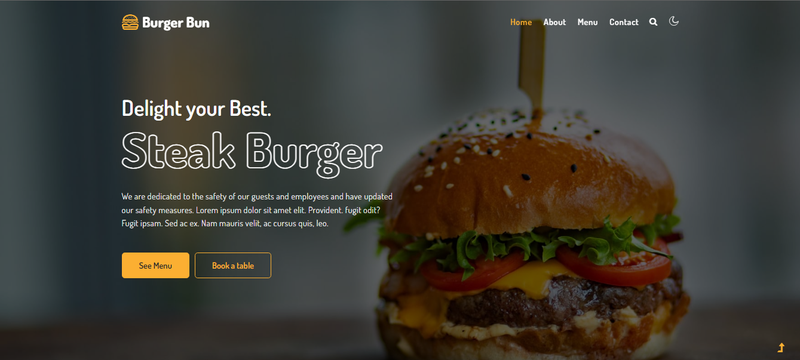
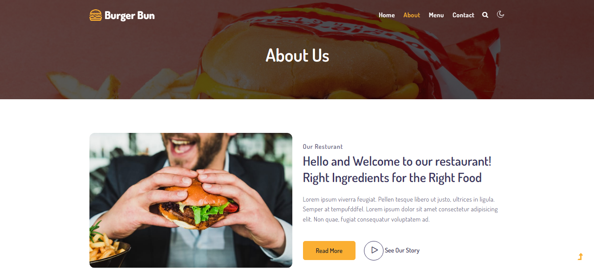
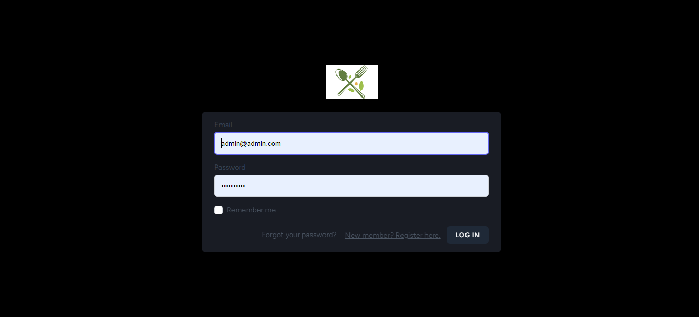

# Internship-Week3-restaurant
Internship-Week3-Restaurant: Mnage Admins, Reservations, Chefs, dishes and Categories and a Home Page for a Restaurant Website (with Laravel)

<h1><ins>Une application web pour gérer le menu d’un restaurant</ins></h1>
Nous recherchons un développeur talentueux pour développer une application web pour gérer le menu d’un restaurant. Les visiteurs pourront visualiser les plats disponibles.

<h4><ins>Fonctionnalités clés :</ins></h4>
<ol> 1. Visualisation des plats disponibles sur le menu.</ol>
<ol> 2. Système d'authentification complet.</ol>
<ol> 3. Gestion du menu par l'administrateur (ajout, édition, suppression de plats)</ol>

<h4><ins>User stories:</ins></h4>
<ul> • En tant qu'administrateur, je peux créer un compte en utilisant mon adresse e-mail et un mot de passe sécurisé.</ul>
<ul> • En tant qu'administrateur, je peux me connecter à mon compte existant en utilisant mon adressee-mail et mon mot de passe.</ul>
<ul> • En tant qu'administrateur, je peux réinitialiser mon mot de passe en utilisant mon adresse e-mail associée à mon compte.</ul>
<ul> • En tant qu'administrateur, je peux modifier les informations de mon compte, telles que mon adresse e-mail et mon mot de passe, en tout temps.</ul>
<ul> • En tant que visiteur, je peux visualiser les différents plats disponibles sur le menu avec des images et des descriptions claires.</ul>
<ul> • En tant qu'administrateur, je peux ajouter, éditer ou supprimer des plats sur le menu en utilisant une interface simple et intuitive.</ul>

<h4><ins>Réalisations attendues :</ins></h4>
<ul> • Il va falloir faire la conception UML (diagramme cas d'utilisation et classes) .</ul>
<ul> • Installer la dernière version de Laravel sur votre machine.</ul>
<ul> • En tant qu'administrateur, je peux réinitialiser mon mot de passe en utilisant mon adresse e-mail associée à mon compte.</ul>
<ul> • Installer une méthode d'authentification de votre choix.</ul>
<ul> • Créer le schéma de base de données des tables et champs nécessaires avec les associations définies.</ul>
<ul> • Générer les fichiers de contrôleurs, modèles et migrations. Créer les interfaces 'views'.</ul>
<ul> • Créer les routes pour les interfaces. Coder la logique des opérations voulues et compléter l'application.</ul>


<h4><ins>Technologies :</ins></h4>
<ul> • Le framework Laravel.</ul>
<ul> • Les interfaces avec le moteur de templating Blade.</ul>
<ul> • L'utilisation de Bootstrap ou d'un autre framework CSS.</ul>


<h4><ins>Modalites :</ins></h4>
<ul> • Travail individuel</ul>
<ul> • Temporalité : 10 jours</ul>
Date Limite de soumission : le 11 août 2023

<h4><ins>Livrables :</ins></h4>
GitHub repo Link qui contient tous les éléments suivants :
1er Livrable : Le 02/08/2023
<ul> ➢ Trello .</ul>
<ul> ➢ Structure projet Laravel ( Première version : Model , Controller , Migration , Blades ...).</ul>
<ul> ➢ La Conception UML .</ul>
2ème Livrable : Le 07/08/2023
<ul> Frontend complet ( Blade Laravel ).</ul>
3ème Livrable : Le 11/08/2023
<ul> ➢ Backend ( Laravel ).</ul>
----------------------------------------------------------------------------------------------------------------------------

# Restaurant

Welcome to Restaurant Website! This document provides step-by-step instructions to help you get started with the project.

## Prerequisites

Before you begin, make sure you have the following software installed:

- [Composer](https://getcomposer.org/)
- [Node.js](https://nodejs.org/)
- [npm](https://www.npmjs.com/)
- [PHP](https://www.php.net/)

## Installation

1. Clone the repository:

   ```bash
   git clone https://github.com/yourusername/project-name.git
   cd project-name

2. Install Composer dependencies:

   ```bash
   composer install

3. Install npm packages:

   ```bash
   npm install
   
4. Copy the .env.example file to .env:

   ```bash
   cp .env.example .env
   
5. Generate an application key:

   ```bash
   php artisan key:generate

6. Update the .env file with your database and other configuration settings.
   
7. Import the database:

   ```bash
   mysql -u yourusername -p yourdatabasename < rest.sql


## Running the Project

1. Start the development server:

   ```bash
   php artisan serve

2. Access the application in your web browser at http://localhost:8000.


## Additional Information

1. For Laravel Mix assets and styles, use npm run dev or npm run watch to compile assets:

2. Remember to keep your .env file secure and never share sensitive information.

If you encounter any issues or need further assistance, feel free to [contact us](mailto:mdoukkani8@gmail.com).

Happy coding!

------------------------------------------------------------------------------------------------------------------------
<h4 align="center" > <ins>Home Page</ins></h4>
<p align="center"></p>
<p align="center">-------------------------------</p>
<h4 align="center" > <ins>About</ins></h4>
<p align="center"></p>
<p align="center">-------------------------------</p>
<h4 align="center" > <ins>Menu</ins></h4>
<p align="center"></p>
<p align="center">-------------------------------</p>
<h4 align="center" > <ins>Chefs</ins></h4>
<p align="center"></p>
<p align="center">-------------------------------</p>
<h4 align="center" > <ins>Contact us and Reservation</ins></h4>
<p align="center"></p>
<p align="center">-------------------------------</p>
<h4 align="center" > <ins>Login Page</ins></h4>
<p align="center"></p>
<p align="center">-------------------------------</p>
<h4 align="center" > <ins>Register Page</ins></h4>
<p align="center"></p>
<p align="center">-------------------------------</p>
<h4 align="center" > <ins>Dashboard Page</ins></h4>
<p align="center"></p>
<p align="center">-------------------------------</p>
<h4 align="center" > <ins>Food Menu Page</ins></h4>
<p align="center"></p>
<p align="center">-------------------------------</p>
<h4 align="center" > <ins>Chefs Page</ins></h4>
<p align="center"></p>
<p align="center">-------------------------------</p>
<h4 align="center" > <ins>Reservation Page</ins></h4>
<p align="center"></p>
<p align="center">-------------------------------</p>
<h4 align="center" > <ins>Admin Page</ins></h4>
<p align="center"></p>
<p align="center">-------------------------------</p>
<h4 align="center" > <ins>Categories Page</ins></h4>
<p align="center"></p>
<p align="center">-------------------------------</p>
<h4 align="center" > <ins>Session Page</ins></h4>
<p align="center"></p>
<p align="center">-------------------------------</p>
<h4 align="center" > <ins>Profile Info Page</ins></h4>
<p align="center"></p>
<p align="center">-------------------------------</p>
<h4 align="center" > <ins>Update Password</ins></h4>
<p align="center"></p>
<p align="center">-------------------------------</p>
<h4 align="center" > <ins>Delete Account</ins></h4>
<p align="center"></p>
<p align="center">-------------------------------</p>


